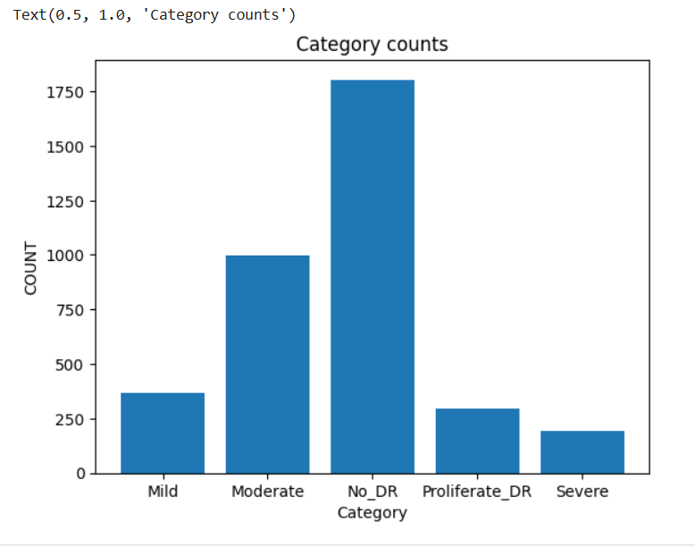

## Overview

This repository documents an advanced Edge AI project focused on classifying Diabetic Retinopathy (DR) from retinal fundus images. What makes this project unique is its deployment target: a low-power, resource-constrained microcontroller. The entire workflow, from data augmentation and model training to 8-bit quantization and bare-metal C inference, is optimized for the **VSDSquadron PRO board**, which is powered by a **SiFive FE310-G002 RISC-V SoC**.

This work is the culmination of a learning journey through the **VLSI System Design (VSD) RISC-V Edge AI course**. It applies foundational AI concepts to solve a complex medical imaging problem under the strict memory and processing limitations of an embedded system (16KB of SRAM), showcasing a complete "lab-to-fabric" Edge AI pipeline.

-----

## 🎯 Project Objective

The primary goal is to build a complete, embedded system for Diabetic Retinopathy classification. The objectives are to:

1.  **Develop a CNN Classifier:** Train a robust model using transfer learning (VGG-16) to classify the severity of DR from retinal images.
2.  **Optimize for the Edge:** Employ **post-training quantization** to convert the model to an 8-bit integer format, drastically reducing its size and making it suitable for microcontrollers.
3.  **Generate Bare-Metal Code:** Convert the quantized TensorFlow Lite model into C-header files containing weights and biases.
4.  **Deploy on RISC-V:** Implement a lightweight inference engine in C to run the model on the SiFive FE310-G002, achieving a classification accuracy of approximately **80%** on the edge device.

-----

## The Edge AI Challenge: Fitting a CNN in 16KB of RAM

Deploying deep learning models on microcontrollers like the SiFive FE310-G002 is non-trivial. A standard floating-point Keras model can be several megabytes in size, while the target board has only **16KB of SRAM**. This project overcomes this challenge through:

  * **Aggressive Quantization:** Converting all model parameters (weights and biases) and activations from 32-bit floating-point to 8-bit integers. This reduces the model size by \~4x.
  * **Optimized C-Inference:** Writing a minimal, bare-metal C function for inference that performs all calculations using integer arithmetic, avoiding the need for heavy floating-point libraries.
  * **Input Data Preprocessing:** Resizing input images to a smaller dimension to reduce the memory footprint of the input tensor.

-----

## 🛠️ Methodology & Deployment Pipeline

The project follows a structured pipeline from Python-based model development to C-based firmware deployment.

### 1\. Data Preprocessing & Augmentation (Python)

To build a robust model, the dataset was carefully prepared using Python scripts:

  * **Image Resizing:** Images were resized to a uniform, smaller dimension (e.g., 96x96) suitable for the embedded target.
  * **Normalization:** Pixel values were scaled for better model convergence.
  * **Data Augmentation:** Techniques like random rotation, flipping, and zooming were applied to expand the dataset and prevent overfitting.
    


### 2\. Model Training & Quantization (TensorFlow)

  * **Transfer Learning:** A **VGG-16** model, pre-trained on ImageNet, was used as the base. Its top layers were replaced with a custom classifier tailored for DR detection.
  * **Post-Training Quantization:** After training, the model was converted to a TensorFlow Lite format and quantized to an 8-bit integer (`INT8`) representation. This step is critical for reducing the model size from megabytes to kilobytes.

### 3\. C-Code Generation & Bare-Metal Inference (RISC-V)

  * **Model to C Array:** The `.tflite` model was converted into C header and source files (`model_params.h`, `model_params.c`) containing the quantized weights and biases as integer arrays.
  * **Lightweight Inference Engine:** Simple C functions were written to perform the core operations of a neural network (like dense layer computation and activation functions) using only integer arithmetic on the RISC-V core. This firmware is designed to be compiled with a bare-metal RISC-V toolchain.


-----

## 💻 Hardware and Software

#### Target Hardware

  * **Board:** VSDSquadron PRO
  * **SoC:** SiFive FE310-G002 (32-bit RV32IMAC instruction set)
  * **Memory:** 16KB SRAM, 128Mbit QSPI Flash

#### Development Environment

  * **AI/ML:** Python 3.x, TensorFlow, Keras, NumPy, Matplotlib
  * **Embedded:** RISC-V GNU Toolchain, Freedom Studio (or similar IDE for simulation/flashing)
  * **Tools:** `xxd` (for model conversion), `zadig-2.9.exe` (for board USB drivers on Windows)

-----

## 📂 Repository Structure

-----

## 🚀 Getting Started

### Part A: Training the Model (Python Environment)

1.  **Clone the repository:**

    ```bash
    git clone https://github.com/<Your-Username>/EdgeAI-DR-RISCV.git
    cd EdgeAI-DR-RISCV
    ```

2.  **Setup Python Environment:**

    ```bash
    cd python_training
    pip install -r requirements.txt
    ```

3.  **Download Dataset:**

      * This project uses the **APTOS 2019 Blindness Detection** dataset from Kaggle.
      * Download it from [here](https://www.kaggle.com/c/aptos2019-blindness-detection) and place it in the `data/` directory.

4.  **Run Training & Quantization:**

      * Open and run the `Diabetic_Retinopathy_Training.ipynb` notebook to train the model, quantize it, and generate the C-arrays.

Deploying to RISC-V Board

### 1. Open Freedom Studio and Import the Project

* Launch **Freedom Studio**.
* Go to **File > Import... > Existing Projects into Workspace**.
* Select the project directory and import it.

### 2. Clean and Build the Project

* Navigate to:

  * **Project > Clean...** — select the project and confirm.
  * **Project > Build Project** — this will compile the project and generate the `main.elf` file.

### 3. Run in Simulation (Optional)

* Configure a debug launch for simulation:

  * Go to **Run > Debug Configurations...**.
  * Create or modify a **SiFive GDB OpenOCD Debugging** configuration.
  * Ensure the **Executable** path points to the correct `main.elf` file.
* Start the simulation.
* Observe output in the **Freedom Studio Console**.

### 4. Flash to VSDSquadron PRO Board

* **Connect the board** via USB.

* If on **Windows**, use [`zadig-2.9.exe`](https://zadig.akeo.ie/) to install the correct USB drivers:

  * Run Zadig.
  * Select the connected USB device (usually shows as "USB Serial" or similar).
  * Choose `WinUSB` as the driver and click **Install Driver**.

* Use your preferred flashing tool, such as **OpenOCD**, to flash the `main.elf` file:

  ```bash
  openocd -f interface/ftdi/vsdsquadron.cfg -f target/sifive.cfg -c "program path/to/main.elf verify reset exit"
  ```

> 💡 Replace `path/to/main.elf` with the actual path to your compiled `.elf` file.

---


## ✨ Key Learnings

This project provides practical experience in the complete end-to-end workflow of an Edge AI application:

  * **Model Optimization:** Mastered post-training quantization to fit large models onto tiny devices.
  * **Bare-Metal Programming:** Understood how to implement ML inference from scratch in C for a RISC-V target without an OS.


-----

## 📜 License

This project is licensed under the **MIT License**. See the `LICENSE` file for details.
## ✨ Acknowledgments
* Thanks to VLSI System Design (VSD) for providing the course resources and project guidance.
* Thanks to SiFive For the FE310-G002 SoC specifications.
* Thanks to the organizers of the APTOS 2019 Blindness Detection challenge for providing the high-quality dataset.
* Credit to the creators of the VGG-16 architecture and the Keras/TensorFlow teams for their powerful deep learning frameworks.
